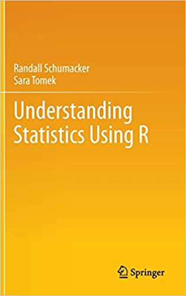

# Understanding Statistics Using R

Provides strong fundamental background in statistics and probability through simulation exercises:
* Authors: Randall Schumacker & Sara Tomek.
* Year: 2013.
* Publisher: SpringerLink.

## Note

The source is [here](http://www.springer.com/cda/content/document/cda_downloaddocument/Schumacker_for_internet.zip?SGWID=0-0-45-1380502-p174721646)
