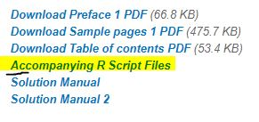

# Understanding Statistics Using R
I share with you all codes used in this incredible book.

Provides strong fundamental background in statistics and probability through simulation exercises:
* Authors: Randall Schumacker & Sara Tomek.
* Year: 2013.
* Publisher: SpringerLink.

## Note
I'm not the author of these programming codes. I took all these files from the official web page of [SpringerLink](https://www.springer.com/gp/book/9781461462262). On that website, you can find the following options:

